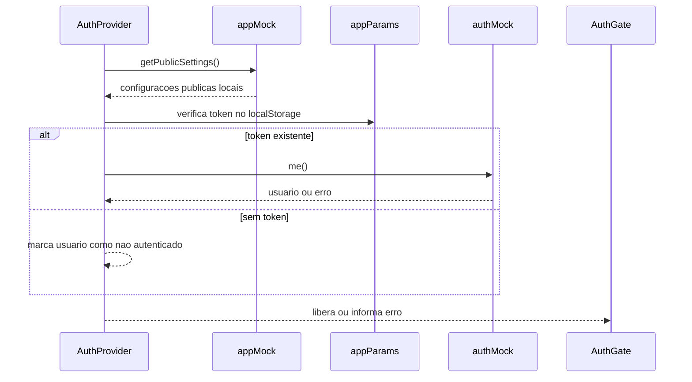
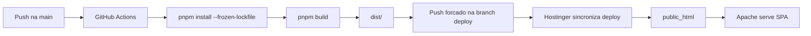

# Arquitetura

## 1. Inicializacao da aplicacao

O navegador carrega `index.html`, que fornece o elemento `#root`, metadados, favicon, manifest e o modulo compilado pelo Vite em producao. Durante o desenvolvimento, o Vite resolve o entrypoint `src/app/main.jsx`.

A cadeia de inicializacao e:

```text
index.html
  -> src/app/main.jsx
    -> src/app/App.jsx
      -> src/app/providers.jsx
        -> src/app/router.jsx
          -> src/pages/Home.jsx
```

`src/app/main.jsx` importa o CSS global e monta `<App />` com `ReactDOM.createRoot`.

## 2. Composicao global

`src/app/App.jsx` mantem a composicao minima da aplicacao. Ele envolve o roteador com `AppProviders`.

`src/app/providers.jsx` registra os providers globais:

- `MantineProvider`: tema, componentes e esquema visual dark da aplicação.
- `ModalsProvider`: modais compartilhados do Mantine.
- `Notifications`: notificações visuais do Mantine.
- `AuthProvider`: estado de autenticacao, usuario, token, carregamento e erros.
- `QueryClientProvider`: instancia global do TanStack React Query definida em `src/lib/query-client.js`.

Essa ordem deve ser preservada quando um componente precisar consumir `useAuth`, React Query ou toasts.

## 3. Roteamento

O roteamento e definido em `src/app/router.jsx` com `BrowserRouter`.

### Rotas publicas de autenticacao

- `/login`: login.
- `/register`: cadastro.
- `/forgot-password`: solicitacao de recuperacao.
- `/reset-password`: redefinicao de senha.
- `/oauth/consent`: consentimento OAuth.

Essas rotas ficam fora do `AuthGate` para evitar redirecionamento circular.

### Rotas protegidas pelo AuthGate

- `/`: pagina institucional `Home`.
- `*`: pagina de rota inexistente.

O `AuthGate` aguarda as configuracoes publicas e a verificacao de autenticacao. Enquanto isso, exibe um carregamento. Quando ocorre erro de autenticacao, ele direciona para a tela adequada ou chama `navigateToLogin`.

Para adicionar uma nova pagina, importe o componente em `src/app/router.jsx` e registre uma nova rota. Para exigir login, use o padrao `ProtectedRoute` existente em `src/features/auth/ProtectedRoute.jsx`.

## 4. Pagina principal

`src/pages/Home.jsx` monta a experiencia institucional nesta ordem:

1. Barra de progresso de scroll.
2. Navbar.
3. Hero.
4. Estatisticas.
5. Problemas atendidos.
6. Divisor visual.
7. Solucoes.
8. Como funciona.
9. Divisor visual.
10. Planos e precos.
11. Sobre a empresa.
12. Contato.
13. Footer.
14. Botao flutuante do WhatsApp.

Os blocos de conteudo ficam em `src/features/home/`. Elementos compartilhados de layout ficam em `src/features/layout/`. Componentes genericos ficam em `src/components/common/`. Os componentes base antigos de `src/components/ui/` foram substituidos por Mantine.

## 5. Autenticacao e sessao

`src/features/auth/AuthContext.jsx` coordena o estado de autenticacao.

Fluxo de inicializacao:



No estado atual, `src/services/auth-mock.js` e deliberadamente um adaptador temporario:

- `appMock.getPublicSettings()` retorna configuracao local vazia.
- `authMock.me()` rejeita com status 401.
- Login, cadastro, OAuth, OTP e recuperacao de senha rejeitam com status 501.
- Tokens sao lidos e removidos do `localStorage` nas chaves `token` e `access_token`.
- `redirectToLogin()` envia o usuario para `/login` e preserva `returnTo`.

Para integrar um provedor real, substitua a implementacao de `authMock` mantendo a interface publica consumida pelo restante da aplicacao.

## 6. Comunicacao com API

`src/services/api.js` expoe os metodos `get`, `post`, `put`, `patch` e `delete` sobre `fetch`.

- A base da URL vem de `import.meta.env.VITE_API_URL`.
- Sem essa variavel, as chamadas usam a mesma origem, como `/api/...`.
- Corpos definidos sao serializados como JSON.
- O token de `appParams` e enviado como `Authorization: Bearer ...`.
- `credentials: include` habilita envio de cookies.
- Respostas JSON sao parseadas automaticamente.
- Falhas geram `ApiError` com mensagem, status e payload.

O servidor local em `server/index.js` so oferece `GET /api/health`. Ele e um placeholder para desenvolvimento e nao substitui um backend de producao.

## 7. Backend planejado

O backend de producao sera construido em **NestJS com adaptador Fastify e TypeScript**, mantendo o frontend React/Vite separado. Essa escolha atende ao crescimento previsto do Painel ADM e e compativel com a execucao Node.js disponibilizada pela Hostinger.

Stack planejada:

- Runtime: Node.js 22.
- Framework: NestJS com Fastify.
- API: REST versionada em `/api/v1`.
- Banco: PostgreSQL.
- ORM: Prisma.
- Validacao: DTOs do NestJS com Zod quando necessario.
- Autenticacao: JWT, refresh token e perfis `admin`, `comercial`, `suporte` e `cliente`.

Organizacao prevista:

```text
server/
  index.js                 entrada temporaria atual
  config/
  http/
    routes/
    controllers/
    middlewares/
    schemas/
  modules/
    health/
    auth/
    admin/
      orcamentos/
      cadastros/
      catalogo/
      chatbot/
      configuracoes/
  services/
  repositories/
  integrations/
  database/
    migrations/
    seeds/
  jobs/
  tests/
```

A migracao incremental deve preservar primeiro `GET /api/health`, depois extrair rotas, controllers, servicos e repositorios por modulo. O `server/index.js` atual continua sendo o bootstrap enquanto o backend real nao for implementado.

## 7. Configuracao e estilos

- `vite.config.js` registra React, o alias `@` e o proxy local de `/api` para `localhost:3001`.
- `jsconfig.json` mantem o alias `@/*` para `./src/*` e habilita verificacao JavaScript.
- `src/styles/index.css` define variaveis de tema, fontes, utilitarios visuais e estilos globais.
- `tailwind.config.js` procura classes em `index.html` e em todo `src/**/*.{ts,tsx,js,jsx}`.
- `src/config/site.js` centraliza nome, logo, WhatsApp, e-mail, cidade, ano e planos/precos.

## 8. Assets estaticos

O Vite copia o conteudo de `public/` para a raiz de `dist/` sem alterar os nomes:

- `public/.htaccess`: fallback do Apache para rotas do React Router.
- `public/logo.png`: logo usada pelo layout e pelo manifest.
- `public/favicon.png`: icone do navegador.
- `public/manifest.json`: metadados PWA e icones.

Nao referencie assets da pasta `src/` por URL absoluta em producao; coloque-os em `public/` ou importe-os pelo codigo para deixar o Vite processa-los.

# Desenvolvimento local

## Pre-requisitos

- Node.js 22, conforme `.nvmrc`.
- Node.js `>=20.19.0` e aceito pelo `package.json`.
- pnpm `>=10`.
- Git.

O projeto usa `packageManager: pnpm@10.0.0`. Prefira pnpm em vez de npm ou yarn para manter o lockfile consistente.

## Instalacao

Na raiz do repositorio:

```powershell
pnpm install
```

Para uma instalacao identica a CI, use:

```powershell
pnpm install --frozen-lockfile
```

## Comandos disponiveis

| Comando | Funcao |
| --- | --- |
| `pnpm dev` | Inicia frontend Vite e servidor Node local simultaneamente. |
| `pnpm dev:front` | Inicia somente o Vite. |
| `pnpm dev:back` | Inicia o servidor Node em modo watch. |
| `pnpm start:back` | Inicia somente o servidor Node. |
| `pnpm build` | Gera o build de producao em `dist/`. |
| `pnpm preview` | Serve o build gerado para verificacao local. |
| `pnpm lint` | Executa ESLint sem corrigir arquivos. |
| `pnpm lint:fix` | Aplica correcoes automaticas do ESLint. |
| `pnpm typecheck` | Executa o TypeScript em modo de verificacao do `jsconfig.json`. |

## Desenvolvimento integrado

`pnpm dev` usa `concurrently` para iniciar:

- Frontend Vite, normalmente em `http://localhost:5173`.
- Backend placeholder em `http://localhost:3001`.

O proxy definido em `vite.config.js` encaminha `/api/*` para a porta definida por `API_PORT`, ou para `3001` quando a variavel nao existe.

Exemplo de verificacao do backend:

```powershell
Invoke-WebRequest http://localhost:3001/api/health
```

## Variaveis de ambiente

O Vite carrega variaveis expostas ao frontend com prefixo `VITE_`.

| Variavel | Uso | Obrigatoria |
| --- | --- | --- |
| `VITE_API_URL` | URL base usada por `src/services/api.js`. | Nao; sem ela usa a mesma origem. |
| `VITE_APP_ID` | Identificador lido por `src/lib/app-params.js`. | Nao no estado mock atual. |
| `API_PORT` | Porta do servidor Node local e destino do proxy Vite. | Nao; padrao `3001`. |

Crie `.env.local` apenas para valores locais. Arquivos `.env` sao ignorados pelo Git e nao devem conter segredos versionados.

## Estrutura de pastas

```text
src/
  app/                 Entrada, providers e roteamento
  components/          Componentes comuns; base visual em Mantine
  config/              Configuracoes de negocio e identidade
  features/auth/       Telas, contexto e adaptadores de autenticacao
  features/home/       Secoes da pagina principal
  features/layout/     Navbar, footer, logo e elementos globais
  hooks/               Hooks reutilizaveis
  lib/                 Parametros, React Query e utilitarios
  pages/               Composicao das paginas roteadas
  services/            Cliente HTTP e autenticacao mock
  styles/              CSS global e tema
public/                Arquivos copiados diretamente para dist/
server/                Backend Node atual e estrutura NestJS planejada
DOCS/                  Documentacao tecnica
```

## Fluxo recomendado para alteracoes

1. Crie ou atualize uma feature na pasta correspondente.
2. Reutilize o alias `@/` para imports internos.
3. Mantenha dados institucionais e precos em `src/config/site.js`.
4. Coloque novos assets estaticos em `public/` quando eles precisarem de URL fixa.
5. Rode `pnpm lint`.
6. Rode `pnpm build`.
7. Verifique `dist/` e teste com `pnpm preview`.
8. Revise o diff antes de enviar para `main`.

## Diagnostico de tela branca local

1. Abra o console do navegador e procure o primeiro erro.
2. Confirme se o HTML de desenvolvimento esta sendo servido pelo Vite, nao por um servidor estatico apontando para `src/`.
3. Se houver erro de import, confirme o alias `@` e a capitalizacao dos caminhos.
4. Se houver erro de API, teste `http://localhost:3001/api/health` e confira `API_PORT`.
5. Em producao, nunca publique o `index.html` da raiz do projeto; publique o conteudo de `dist/`.

# Operacao e deploy

## Modelo de publicacao

A Hostinger usa uma conexao Git generica que copia arquivos, mas nao executa `pnpm install` nem `pnpm build`. Por isso o projeto usa o GitHub Actions para gerar o build antes da Hostinger sincronizar os arquivos.



## Workflow do GitHub Actions

O arquivo `.github/workflows/deploy.yml` e acionado por push em `main`.

Etapas:

1. Faz checkout do repositorio.
2. Configura pnpm usando a versao indicada no `package.json`.
3. Configura Node.js 22 e cache do pnpm.
4. Executa `pnpm install --frozen-lockfile`.
5. Executa `pnpm build`.
6. Entra em `dist/`.
7. Inicializa um repositorio temporario na branch `deploy`.
8. Publica o conteudo de `dist/` na branch remota `deploy` usando `GITHUB_TOKEN`.

A branch `deploy` deve ter na raiz `index.html`, `assets/`, `.htaccess`, `manifest.json` e os assets publicos. Ela nao deve conter `src/`, `package.json` ou a estrutura de desenvolvimento.

## Configuracao na Hostinger

Na conexao Git do hPanel:

- Repositorio: `CODEVANCE-TECH-LTDA`.
- Branch: `deploy`.
- Implantar no diretorio raiz: ativado.
- Diretorio de destino: `public_html`.
- Nao informe `dist` como subpasta, pois a branch `deploy` ja possui o conteudo de `dist/` diretamente na raiz.

Se a tela branca mostrar `/src/app/main.jsx` ou o navegador receber `text/plain` para esse arquivo, a Hostinger esta servindo a `main` ou arquivos antigos. Limpe o `public_html`, remova sobras de deploy anterior e sincronize novamente a branch `deploy`.

## Fallback do React Router

`public/.htaccess` e copiado para `dist/.htaccess`. Ele deixa arquivos e diretorios reais passarem normalmente e encaminha rotas desconhecidas para `index.html`:

```apache
RewriteEngine On
RewriteBase /
RewriteRule ^index\.html$ - [L]
RewriteCond %{REQUEST_FILENAME} !-f
RewriteCond %{REQUEST_FILENAME} !-d
RewriteRule . /index.html [L]
```

Esse arquivo e necessario para que uma rota como `/login` ou uma URL acessada diretamente nao retorne 404 no Apache.

## Verificacao pos-deploy

Abra o codigo-fonte do dominio e confirme:

```html
<script type="module" crossorigin src="/assets/index-...js"></script>
```

A linha nao pode apontar para `/src/app/main.jsx`.

Teste tambem estes recursos:

```text
https://cdvancetech.com/manifest.json
https://cdvancetech.com/favicon.png
https://cdvancetech.com/logo.png
https://cdvancetech.com/assets/index-...js
```

Resultados esperados:

- `index.html`: `text/html`.
- JavaScript em `assets/`: `text/javascript` ou MIME JavaScript equivalente.
- `manifest.json`: `application/manifest+json` ou `application/json`.
- PNGs: `image/png`.
- Rotas do React Router: retornam a aplicacao, nao 404.

Depois da sincronizacao, limpe o cache do navegador com `Ctrl+Shift+R` e, se necessario, limpe o cache da Hostinger em **Desempenho -> Cache**.

## Diagnostico por sintoma

| Sintoma | Causa mais provavel | Acao |
| --- | --- | --- |
| `main.jsx` com MIME `text/plain` | Hostinger servindo `main` ou fonte sem build. | Mudar a conexao para `deploy`, limpar `public_html` e redeployar. |
| `/assets/index-*.js` 404 | Build nao foi publicado ou branch errada. | Conferir Actions e arquivos da branch `deploy`. |
| `/manifest.json` 404 | Arquivo ausente no diretorio publicado. | Confirmar `public/manifest.json` e redeployar `deploy`. |
| `/favicon.png` 404 | Asset ausente ou publicacao incompleta. | Confirmar `public/favicon.png` na branch `deploy`. |
| Rota interna retorna 404 ao atualizar | `.htaccess` ausente ou Apache sem rewrite. | Confirmar `dist/.htaccess` e suporte a `mod_rewrite`. |
| Workflow nao aparece no Actions | Workflow nao chegou na `main`. | Verificar commit e push de `.github/workflows/deploy.yml`. |
| Workflow vermelho no build | Falha de instalacao ou build. | Abrir o log da etapa que falhou e corrigir localmente com os mesmos comandos. |

## Checklist de release

- [ ] `pnpm install --frozen-lockfile` passa.
- [ ] `pnpm lint` passa.
- [ ] `pnpm build` passa.
- [ ] `dist/index.html` referencia `/assets/...js`.
- [ ] `dist/` contem `.htaccess`, manifest e assets publicos.
- [ ] Push foi enviado para `main`.
- [ ] GitHub Actions terminou verde.
- [ ] Branch `deploy` foi atualizada.
- [ ] Hostinger esta configurada para `deploy` e `public_html`.
- [ ] Cache da Hostinger e do navegador foi invalidado.
